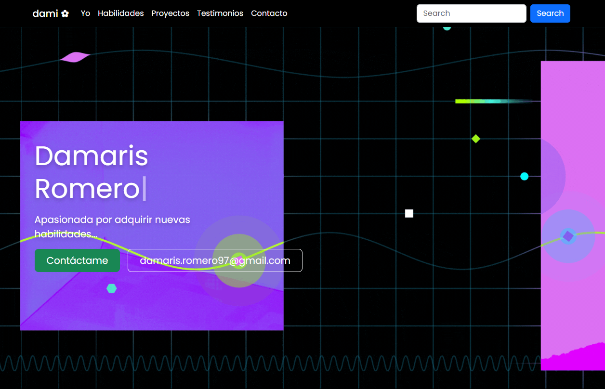
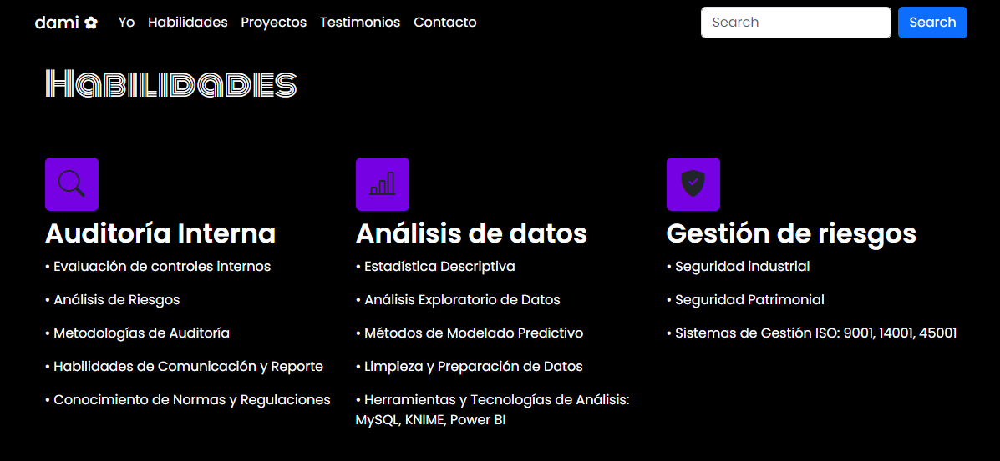
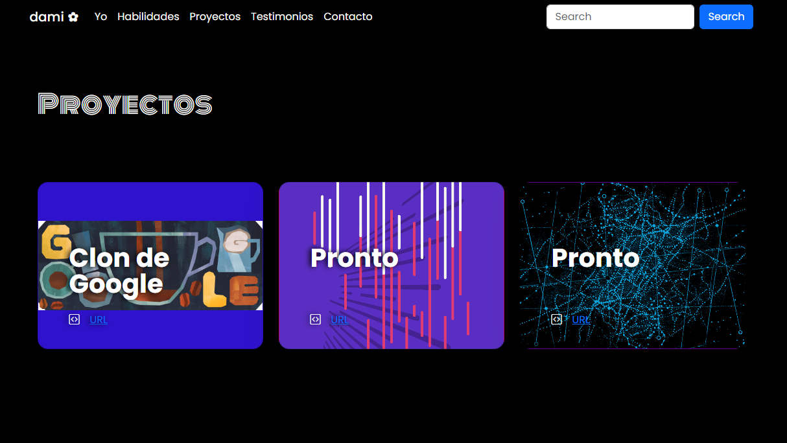
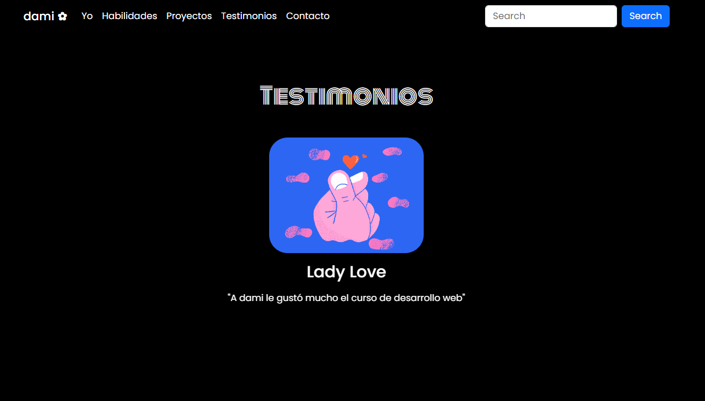
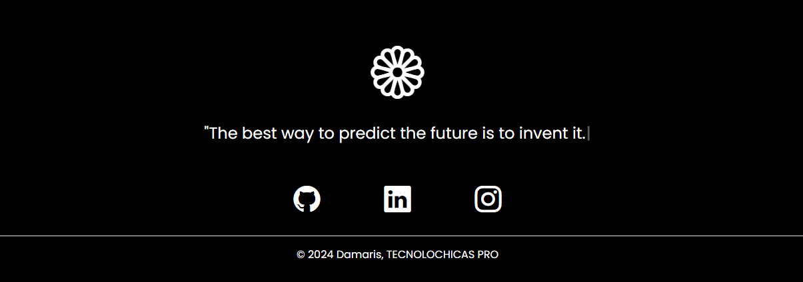

# Mi portafolio de habilidades TECNOLOCHICAS PRO 💜

**El presente proyecto es un portafolio desarrollado para poner en práctica las habilidades obtenidad dentro del bootcamp de desarrollo frontend de Technolochicas PRO.**

**Fue desarrollado con HTML, CSS y JS con el uso de el framework de UI, Bootstrap utilizando además bibliotecas externas.**

La página es responsiva (adaptable a diferentes tamaños de pantalla) e incluye la presentación de la autora del proyecto.

[Proyecto desplegado (https://app.netlify.com/teams/dami-roma/sites)](https://app.netlify.com/teams/dami-roma/sites)

Mi portafolio https://damarisromerotecnolochicaspro.netlify.app/

## Secciones de mi sitio

## Tecnologías

* HTML
* CSS
* Bootstrap
* Javascript

---

Desarrollado con  💜 por [Damaris](http:) en [TECHNOLOCHICAS PRO](https://tecnolochicas.mx/)
